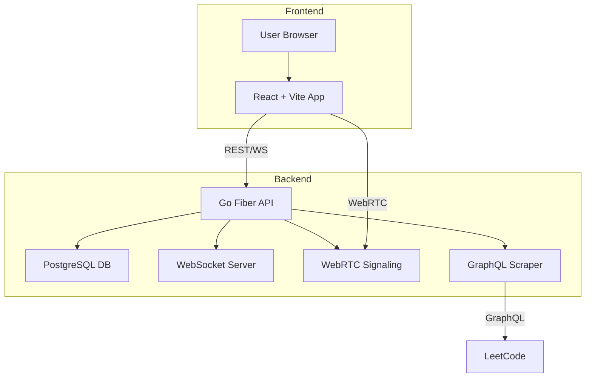
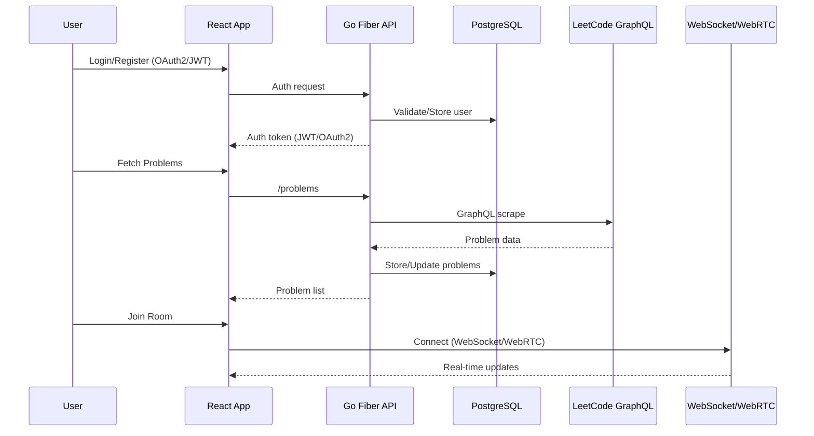
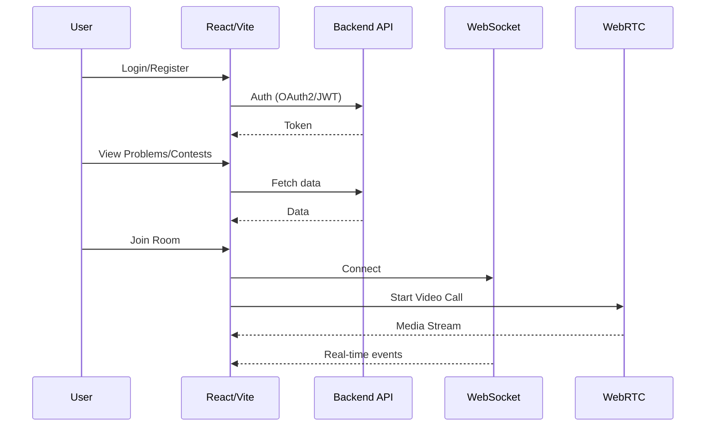

<div align="center">
  
  
  # Dojo
  
  <b>A place to practice your CP skills alone or with your squad</b>
  
  <p>
    
    
    
    
    
    
    
    
    
    
    
    
    
    
    
    
    
    
    
    
    
    
    
    
    
    
  </p>
</div>

---

## 📖 About

**Dojo** is a full-stack, production-grade competitive programming platform. It enables users to practice, compete, and collaborate on coding problems, both solo and in real-time with friends. Built with a modern tech stack, it features:

- **Go + Fiber** backend (RESTful API, JWT & OAuth2, PostgreSQL, GORM)
- **React + Vite + TypeScript** frontend (TailwindCSS, Zustand, React Query, Framer Motion, Three.js)
- **LeetCode scraping via GraphQL** for up-to-date problem data
- **Video calling & real-time rooms** using WebRTC and WebSockets
- **CI/CD** with GitHub Actions, deployed on Vercel

---

## 🚀 Tech Stack & Tools

<p>
  
  
  
  
  
  
  
  
  
  
  
  
  
  
  
  
  
  
  
  
  
  
</p>

---

## 🏗️ Architecture Overview



---

## 🔄 Backend Workflow



---

## 🖥️ Frontend Workflow



---

## ✨ Features

- 🔐 **Authentication:** Email/password, Google, GitHub (OAuth2 & JWT)
- 👤 **Profile:** User info, platform handles
- 🏆 **Problems:** Search, filter, mark as solved, sync from LeetCode/Codeforces
- 📅 **Contests:** Upcoming/past contests, reminders
- 📝 **Sheets:** Create, edit, share problem sheets
- 🧑‍🤝‍🧑 **Rooms:** Real-time collab, code sync, whiteboard, video call (WebRTC)
- 📊 **Dashboard:** Stats, recent activity, solved count
- 🎨 **Modern UI:** Responsive, animated, dark mode
- ⚡ **CI/CD:** Automated deploys with GitHub Actions & Vercel

---

## 🛠️ Getting Started

### Prerequisites

- Go 1.21+
- Node.js 18+
- PostgreSQL 15+

### Backend Setup

```bash
cd Backend
cp .env.example .env
go mod tidy
go run main.go
```

### Frontend Setup

```bash
cd client--
cp .env.example .env
npm install
npm run dev
```

---

## 📝 Usage

1. Register/Login (OAuth2/JWT)
2. Sync problems from LeetCode/Codeforces (GraphQL scraping)
3. Join/host rooms for real-time collaboration (WebSocket/WebRTC)
4. Track progress, solve problems, join contests

---

## 🤝 Contributing

Contributions are welcome! Please fork the repo, create a feature branch, and open a PR. Follow code style and add documentation for new features.

---

## 📄 License

This project is licensed under the MIT License - see the LICENSE file for details.

---

## 📧 Contact

Mrinmoy - [LinkedIn](https://www.linkedin.com/in/mrinmoy-matilal)

Project Link: [https://github.com/richochetclementine1315/Dojo](https://github.com/richochetclementine1315/Dojo)
